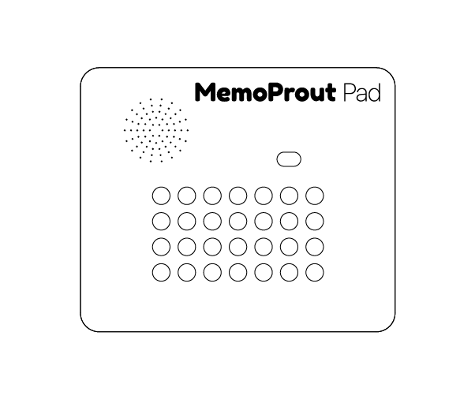
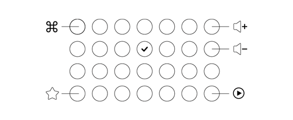

# MemoProut Pad© - Guide de l'utilisateur

Version 1.0 - mis à jour le 21 novembre 2019

MemoProut Pad© est un jeu audio adapté aux pas trop petits et aux plus grands

1. haut-parleur
2. bouton marche/arrêt
3. DC/jack
4. micro USB
5. lecteur de cartes SD
6. pile 9V
7. boutons
8. indicateur de réponse

## Démarrage

Après avoir mis le **bouton marche/arrêt sur _ON_**, MemoProut Pad© affiche le message _PROUT_ et joue le délicat son de démarrage.

## Les contrôles

### Menu

##### Commandes standards

Dans le menu, les boutons correspondants aux commandes standards sont éclairés.

+ ⌘) changer le mode de jeu
+ ☆) meilleur score
+ vol+) augmenter le volume
+ vol-) diminuer le volume
+ ▶) commencer une nouvelle partie

##### Commande cachée

Il existe une commande cachée permettant de lancer un programme de vérification de l'état des leds. Pour lancer ce programme, il suffit d'appuyer sur le bouton ✔️ (situé dans la 4eme colonne et 2eme ligne).

Un appui long sur n'importe quel bouton permet de revenir au menu.

### Pendant une partie

Pendant une partie, tu peux effectuer des combinaisons de touches pour effectuer des actions. Il te suffit d'appuyer sur deux boutons en même temps. Les combinaisons possibles sont :

+ ⌘ + ▶) rejouer toute la séquence
+ ⌘ + ☆) quitter la partie et retourner au menu
+ ▶ + vol+) augmenter le volume
+ ▶ + vol-) diminuer le volume

## Le jeu

MemoProut Pad© est un jeu de mémorisation.

#### Comment jouer ?

Au début de la partie, un son est joué et un bouton est rétro-éclairé. Il faut alors appuyer sur ce bouton.

Ensuite, un autre son est joué lié à un autre bouton. Il faut maintenant répéter la séquence complète en repartant du premier bouton. Et ainsi de suite...

Chaque nouveau son apporté à la séquence rapporte un point. Le meilleur score est systématiquement enregistré.

#### Modes de jeu

Il existe 4 modes de jeu différents. 

* **Classic:** Le MemoProut originel, créé en l'an de grâce 2009. C'est par lui que tout à commencé. Dans cette version, les sons joués forment des phrases hallucinées à l'humour parfois douteux.

* **Kids:** Basée sur la version _Classic_, cette version édulcorée est agréablement vocalisée par les plus beaux enfants du monde.

* **Cinema:** La nostalgie vous tend les bras avec cette version cinema et ses extraits de films en guise de sons. Choisis minutieusement, ces moments cultes sont autant de délicieuses petites madeleines de Prout !

* **Music:** La _rock n' roll_ attitude façon MemoProut !

## Mise en garde

- Ne pas jeter sur la voie publique
- Ne pas s'assoir dessus
- Ne pas mettre au réfrigérateur ou au congélateur
- Ne pas non plus mettre au four

Les médecins recommandent une utilisation journalière mais pas trop prolongée de MemoProut Pad©. 

## Conseils d'utilisation

Cet objet de convoitise unique à la finition exceptionnelle fera de toi la personne la plus appréciée de ton entourage. Pour éviter cela, nous te conseillons de jouer à  MemoProut Pad© exclusivement aux toilettes. Même avec le volume au maximum, personne ne se doutera de rien !

## Problèmes et solutions

**Les sons se jouent au ralenti, ou ne se jouent plus du tout.**

> Il est sûrement temps de changer la pile !

**Ça me dit tout le temps "t'es trop trop nul(le)".**

> Entraine-toi, persévère et tu seras récompensé(e) !

**Lorsque j'allume mon MemoProut Pad© l'indicateur de réponse clignote en rouge et un message "NO SD" apparait sur les boutons.**

> Vérifie que la carte SD soit correctement mise.

**Lorsque j'allume mon MemoProut Pad© l'indicateur de réponse clignote en rouge et un message "NO CONFIG" apparait sur les boutons.**

> La carte SD ne contient pas les bonnes données.
>
> Il faut remettre dessus les données d'origine. Pour récupérer les données, télécharge ce fichier zip : https://github.com/kaelhem/memoprout/archive/master.zip et dézippe-le.
>
> Copie ensuite le contenu du repertoire _master/data_ à la racine de la carte SD.

**J'ai une mémoire pourrie. Puis-je utiliser MemoProut Pad© comme coussin péteur ?**

> Oui, bien sûr. Il suffit de placer MemoProut Pad© à côté de votre cible et de l'allumer discrètement. Attention, ne pas le placer sous les fesses de votre cible (voir la section _Mise en garde_).

**Un autre problème ?**

> Tu peux consulter la FAQ sur le site web : memoproutpad.netlify.com

_La plupart des problèmes de MemoProut Pad© peuvent se règler magiquement en tapant dessus, avec suffisamment de vigueur pour réparer le problème, mais pas trop d'acharnement pour ne pas en créer un nouveau._

## Informations

Site web : [memoproutpad.netlify.com](https://memoproutpad.netlify.com)

Github: https://github.com/kaelhem/memoprout

## Légal

MemoProut Pad© n'est pas une marque réservée. N'importe qui peut l'utiliser comme bon lui semble. D'ailleurs, *CacaCucu* n'est pas reservée non plus... à bon entendeur !
